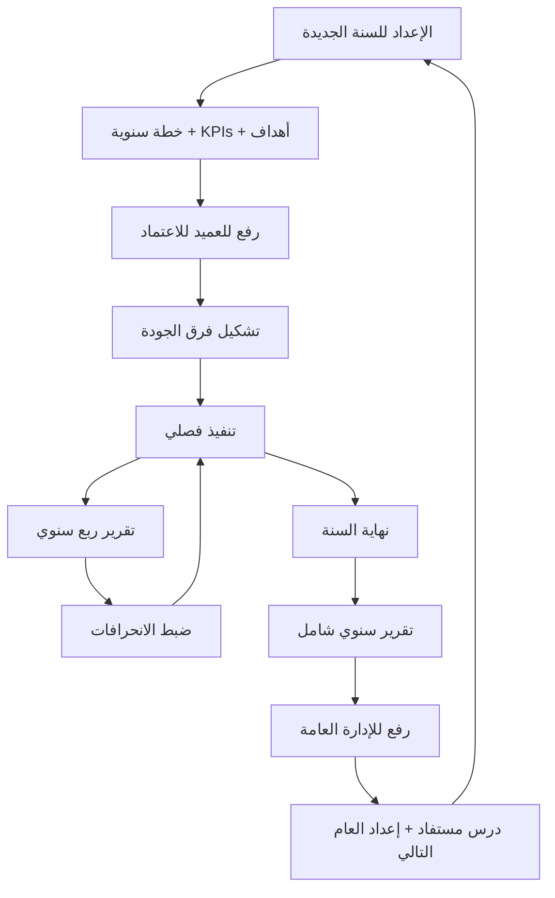

# تحليل دور وكيل الجودة ومنسق وحدة ضبط الجودة

> مراجعة استراتيجية للأدوار المحورية في منظومة الجودة بالكلية، مع مقارنة بالنظام الحالي وتحديد الفجوات والأولويات.

---

## ١. الملف الوظيفي (Role Profiles)

### وكيل الجودة (VICE_DEAN_QUALITY)
| العنصر | القيمة |
|---|---|
| **التبعية المباشرة** | عميد الكلية |
| **التبعية غير المباشرة** | الإدارة العامة للتدريب التقني والمهني بالمنطقة |
| **الفريق التابع** | وحدة ضبط الجودة (منسق+) |
| **scope** | TENANT (الكلية كاملة) |
| **طبيعة العمل** | استراتيجية + رقابية + تنسيقية |
| **مستوى المسؤولية (RACI)** | Accountable على نتائج الجودة |
| **الإيقاع** | فصلي للخطط، أسبوعي للمتابعة، سنوي للاعتماد |

### منسق وحدة ضبط الجودة (QUALITY_COORDINATOR)
| العنصر | القيمة |
|---|---|
| **التبعية المباشرة** | وكيل الجودة |
| **scope** | UNIT (وحدة ضبط الجودة) |
| **طبيعة العمل** | تنفيذية + ميدانية + توثيقية |
| **مستوى المسؤولية (RACI)** | Responsible للتنفيذ اليومي |
| **الإيقاع** | يومي للقياسات، أسبوعي لمتابعة خطط التحسين |

---

## ٢. مهام وكيل الجودة (من PDF) → عمليات النظام

### المهام العشر من الوثيقة الرسمية:

| # | المهمة (PDF) | RACI | العملية في النظام | الصلاحية الحالية | الحالة |
|---|---|---|---|---|---|
| 1 | إعداد الخطط الفصلية والسنوية لعمليات ضبط الجودة | A (R: Coordinator) | `POST /quality/plans` (سنوية + فصلية) | `quality.plan.create_seasonal` `quality.plan.create_yearly` | ⚠️ Permissions موجودة لكن **لا يوجد model `QualityPlan`** |
| 2 | متابعة تنفيذ الخطة التشغيلية والتحقق من تحقيق الأهداف الاستراتيجية | A | Dashboard ربط بـ KPIs + Strategic Objectives | — | ❌ غير موجود |
| 3 | تشكيل الفرق اللازمة لإنجاز أعمال الجودة + الرفع للعميد | R+A | `POST /quality/teams` + workflow اعتماد | `quality.team.charter` | ⚠️ Permission موجودة لكن **لا يوجد model `QualityTeam`** |
| 4 | الإشراف على عمليات/إجراءات ضبط الجودة + خطط التحسين | A | Improvement Plans (موجود) + Procedures (ناقص) | `quality.improvement_plan.execute` | ✅ جزئياً (improvement plans موجودة) |
| 5 | تقديم الدعم لفرق عمل الجودة | A | Tasks للفرق + متابعة | — | ❌ غير موجود |
| 6 | قياس أداء المؤشرات + رفع التقارير للإدارة العامة | R+A | KPIs + Submitted reports for DG | `quality.kpi.update/measure` `quality.report.dg_submit` | ✅ KPIs موجودة، DG report submission ⚠️ نقطة نهاية فقط |
| 7 | نشر ثقافة الجودة + جوائز التميز + اعتماد | A | Accreditation tracker + Cultural campaigns | `quality.accreditation.manage` | ❌ غير موجود |
| 8 | ترشيح منسوبي المنشأة لدورات/ندوات/مؤتمرات | R+A | Nominations workflow | — | ❌ غير موجود |
| 9 | متابعة قياس نواتج التدريب في الأقسام | A | Outcomes measurement per dept (يربط KPI بقسم) | `quality.training_outcomes.measure` | ⚠️ Permission موجودة، **بدون شاشة/منطق** |
| 10 | أي مهام أخرى في مجال جودة التدريب | — | — | — | عام |

**ملخص**: ٩ مهام تحتاج تنفيذ. **٤ موجودة جزئياً**، **٥ ناقصة كلياً**.

---

## ٣. مهام منسق الجودة (مستنبطة من قسم وكالة الجودة)

| # | المهمة | RACI | العملية | الصلاحية الحالية | الحالة |
|---|---|---|---|---|---|
| 1 | تنفيذ القياسات الدورية لـ KPIs | R | `POST /quality/kpis/:id/measurements` | `quality.kpi.measure` | ✅ |
| 2 | إعداد ونشر الاستبيانات (متدربين/موظفين/خريجين) | R | `POST /quality/surveys` | `quality.survey.create` | ✅ |
| 3 | تسجيل المخاطر التشغيلية | R | `POST /quality/risks` | `quality.risk.register` | ✅ |
| 4 | تنفيذ خطوات خطط التحسين | R | `POST /quality/improvement-plans/:id/start` | `quality.improvement_plan.execute` | ✅ |
| 5 | جمع شواهد لمعايير الاعتماد | R | Accreditation evidence upload | — | ❌ |
| 6 | متابعة فرق الجودة (تذكيرات بمواعيد التسليم) | R | Quality Tasks | — | ❌ |
| 7 | إعداد التقارير الدورية للوكيل | R | TrainerReport-like model | — | ❌ |
| 8 | نشر ثقافة الجودة (workshops، ميديا) | C | Campaigns | — | ❌ |
| 9 | توثيق نواتج التدريب من كل قسم | R | Outcomes per dept | `quality.training_outcomes.measure` | ⚠️ بدون شاشة |
| 10 | ترشيح للدورات (proxy) | C | Nominations | — | ❌ |

**ملخص**: ١٠ مهام. **٤ موجودة بالكامل**، **٦ ناقصة**.

---

## ٤. مصفوفة RACI الكاملة

| العملية | منسق | وكيل الجودة | عميد | إدارة عامة | حالة النظام |
|---|:-:|:-:|:-:|:-:|---|
| إعداد KPI | R | A | C | I | ✅ |
| قياس KPI شهري | R | A | I | I | ✅ |
| إعداد خطة سنوية للجودة | R | A | C | I | ❌ |
| اعتماد الخطة السنوية | — | R | A | I | ❌ |
| تشكيل فريق جودة | R | R | A | — | ❌ |
| إطلاق استبيان | R | A | I | — | ✅ |
| تنفيذ خطة تحسين | R | A | I | — | ✅ |
| تسجيل مخاطرة | R | A | — | — | ✅ |
| إدارة اعتماد أكاديمي | R | A | C | I | ❌ |
| ترشيح منسوبي للدورات | R | A | C | — | ❌ |
| تقرير ربع/سنوي للإدارة العامة | R | A | C | I | ⚠️ (طباعة PDF موجودة لكن بدون submission flow) |
| قياس نواتج التدريب لقسم | R | A | C | — | ⚠️ بدون UI |
| نشر ثقافة الجودة | R | A | I | — | ❌ |

R = Responsible · A = Accountable · C = Consulted · I = Informed

---

## ٥. مراجعة الصلاحيات الحالية vs المطلوبة

### VICE_DEAN_QUALITY (12 permission حالياً)

| الصلاحية | موجودة؟ | ملاحظة |
|---|:-:|---|
| `quality.kpi.update` | ✅ | شاشة موجودة |
| `quality.kpi.measure` | ✅ | شاشة موجودة |
| `quality.survey.create` | ✅ | endpoint موجود (شاشة بسيطة) |
| `quality.risk.register` | ✅ | endpoint موجود |
| `quality.plan.create_seasonal` | ✅ permission | **🔴 لا يوجد model أو شاشة** |
| `quality.plan.create_yearly` | ✅ permission | **🔴 لا يوجد model أو شاشة** |
| `quality.team.charter` | ✅ permission | **🔴 لا يوجد model أو شاشة** |
| `quality.improvement_plan.execute` | ✅ | شاشة موجودة |
| `quality.accreditation.manage` | ✅ permission | **🔴 لا يوجد model أو شاشة** |
| `quality.training_outcomes.measure` | ✅ permission | **🔴 لا يوجد شاشة** |
| `quality.report.dg_submit` | ✅ permission | **🟡 مطبوع PDF فقط، بدون submission state** |
| `council.meeting.create` | ✅ | شاشة موجودة |

**صلاحيات يفترض إضافتها**:
- `quality.nomination.recommend` (ترشيح للدورات)
- `quality.team.assign` (إسناد مهام لفرق الجودة)
- `quality.evidence.upload` (رفع شواهد الاعتماد)

### QUALITY_COORDINATOR (5 permissions حالياً)

| الصلاحية | كافية؟ | ملاحظة |
|---|:-:|---|
| `quality.kpi.measure` | ✅ | |
| `quality.survey.create` | ✅ | |
| `quality.risk.register` | ✅ | |
| `quality.improvement_plan.execute` | ✅ | |
| `quality.training_outcomes.measure` | ✅ | |

**صلاحيات يفترض إضافتها للمنسق**:
- `quality.team.update_task` (تحديث حالة مهامه في الفريق)
- `quality.evidence.upload` (رفع شواهد)
- `quality.coordinator.report.submit` (تقرير دوري للوكيل)

---

## ٦. الشاشات الموجودة vs المطلوبة

### ✅ شاشات موجودة فعلياً
1. `/dashboard/quality` — قائمة KPIs مع progress bars + استبيانات + مخاطر
2. `/dashboard/quality/improvement` — خطط التحسين (CRUD + lifecycle: DRAFT→IN_PROGRESS→COMPLETED)
3. `/dashboard/reports/kpi` — تقرير KPIs قابل للطباعة

### 🔴 شاشات ناقصة (مرتبة بالأولوية)

| # | الشاشة | الوصف | الأهمية | الجهد |
|---|---|---|---|---|
| **1** | `/dashboard/quality/dashboard` | لوحة الجودة الاستراتيجية الموحّدة (heatmap للأقسام + KPIs بـ traffic light + اتجاه + خطر) | 🔥 **استراتيجية** | 4س |
| **2** | `/dashboard/quality/plans` | الخطط الفصلية والسنوية + workflow اعتماد + متابعة الأنشطة | 🔥 **استراتيجية** | 4س |
| **3** | `/dashboard/quality/teams` | فرق الجودة (charter + أعضاء + مهام + استحقاقات) | عالي | 4س |
| **4** | `/dashboard/quality/accreditation` | متابعة الاعتماد الأكاديمي (معايير + شواهد + ثغرات + مرحلة) | 🔥 **استراتيجية** | 6س |
| **5** | `/dashboard/quality/training-outcomes` | نواتج التدريب لكل قسم (مع correlations لـ KPIs) | عالي | 3س |
| **6** | `/dashboard/quality/nominations` | ترشيحات المنسوبين للدورات الخارجية + workflow | متوسط | 3س |
| **7** | `/dashboard/quality/dg-reports` | التقارير المرفوعة للإدارة العامة (مع timeline) | متوسط | 2س |
| **8** | `/dashboard/quality/me` (للمنسق) | "مهامي" — قياسات معلّقة + شواهد ناقصة + خطط تنفيذية | عالي | 3س |
| **9** | `/dashboard/quality/culture` | حملات نشر ثقافة الجودة + ورش + أحداث | منخفض | 3س |

**المجموع**: ٩ شاشات × متوسط ٣.٥س = **~٣٢ ساعة**

---

## ٧. User Stories لوكيل الجودة

### Epic 1: متابعة استراتيجية للأداء

```
As VD Quality, when the term ends,
I want to see my institution's heatmap (which dept achieved which KPI),
So I can quickly know where to intervene next term.
```

```
As VD Quality, when a KPI dips below threshold,
I want an automatic alert + suggestion to open an improvement plan,
So I act before the gap becomes a crisis.
```

```
As VD Quality, when I prepare for the dean's quarterly meeting,
I want a one-click PDF report of all KPIs + progress + risks,
So I save 4 hours of manual compilation.
```

### Epic 2: التخطيط الفصلي والسنوي

```
As VD Quality, at the start of each fiscal year,
I want to draft a yearly plan with goals + activities + owners + deadlines,
So my coordinator and dept heads have clear deliverables.
```

```
As VD Quality, when I finalize a plan,
I want to send it to the dean for approval through workflow,
So the plan has organizational buy-in and isn't just my opinion.
```

```
As VD Quality, mid-quarter,
I want to see "% completion of activities" per goal,
So I redirect resources to lagging activities.
```

### Epic 3: الاعتماد الأكاديمي

```
As VD Quality, when accreditation cycle approaches,
I want a checklist of all standards (e.g., 20 standards × 5 sub-criteria),
For each: status (not-started, in-progress, evidence-ready, verified) + evidence files,
So I never face the surprise "we have no evidence for criterion 3.4" 2 weeks before audit.
```

```
As VD Quality, after each accreditation visit,
I want to log findings + recommendations + corrective action plan,
So next cycle starts where last one ended.
```

### Epic 4: تشكيل الفرق

```
As VD Quality, when I form a quality team for a specific objective,
I want to define charter (purpose, scope, members, deadline, deliverables),
And send it to the dean for approval,
So everyone knows their role and there's organizational sponsorship.
```

```
As VD Quality, when my team has multiple parallel tasks,
I want a kanban-style board (To Do / In Progress / Done),
So I see status without 1:1 meetings.
```

### Epic 5: نواتج التدريب

```
As VD Quality, when I want to assess Department X's training outcomes,
I want to see pass rate × employer satisfaction × graduate employment × KPI achievement,
So I distinguish surface compliance (filled forms) from real outcomes (graduates with jobs).
```

### Epic 6: التواصل مع الإدارة العامة

```
As VD Quality, at end of quarter,
I want to submit a structured report to the regional GM
(cover, executive summary, KPIs, risks, achievements, asks),
With a tracking number + history + GM's feedback when available,
So I know my reports are received and acted upon, not lost in email.
```

---

## ٨. User Stories لمنسق الجودة

### Epic 1: العمل اليومي

```
When I log in in the morning,
I want to see "today's tasks": measurements due, evidence uploads pending, action items from yesterday's meeting,
So I know exactly what to do without asking the vice dean.
```

```
When I take a measurement (e.g., monthly trainee retention rate),
I want to enter it once + it propagates to KPI + dashboard + reports,
Not enter it 3 times in 3 systems.
```

### Epic 2: متابعة خطط التحسين

```
As QA Coordinator, when I'm assigned an action in an improvement plan,
I want a deadline reminder + a one-click "Mark done with note",
So I close it without writing a long email.
```

### Epic 3: شواهد الاعتماد

```
When the vice dean asks for evidence for accreditation criterion 3.4,
I want to upload a PDF/photo from my phone in 2 taps,
And the system tags it: criterion 3.4 + date + uploader,
So nothing gets lost in WhatsApp groups.
```

### Epic 4: التقارير

```
End of each week,
I want to log: what measurements I took, what plans I executed, what blockers I face,
In a 5-minute structured format → goes to the vice dean.
```

---

## ٩. رحلة وكيل الجودة (Quality Lifecycle)

### السنوية (Annual cycle)



### الفصلية (Quarterly)

| الأسبوع | الحدث | المخرج |
|---|---|---|
| 1 | بدء الفصل + إطلاق خطة فصلية | مسوّدة الخطة |
| 2 | تشكيل/تحديث الفرق | charter موقّع |
| 4 | بداية القياسات | KPI measurements |
| 8 | منتصف الفصل: مراجعة | تقرير منتصف |
| 10 | إطلاق خطط تحسين للأقسام المتأخرة | QIP |
| 12 | استبيانات الفصل | survey responses |
| 14 | تقرير نهاية الفصل | DG report |

### نقاط الاحتكاك الحالية (Current Pain Points)

1. **تعدد المصادر**: KPIs في Excel، الخطط في Word، الفرق في WhatsApp → لا توجد رؤية موحّدة
2. **التأخر في معرفة الانحراف**: تظهر المشكلة بعد 8 أسابيع لمّا يكون التدخل صعباً
3. **ضياع الشواهد**: شهادات + صور + تقارير تتشتت بين أعضاء الفرق
4. **التقارير التكرارية**: نفس البيانات تُكتب 3 مرات (داخلي + للعميد + للإدارة العامة)
5. **عدم تتبع الترشيحات**: ترشحت 5 موظفين لدورات، اللي راحوا = ٢ فقط، لا أعرف لماذا

---

## ١٠. ركائز UX المميزة لوكيل الجودة

### 🎯 P1: Single Source of Truth
كل KPI، خطة، فريق، اعتماد، شاهد → في مكان واحد. لا Excel، لا Word، لا WhatsApp.

### 🚦 P2: Traffic Light Everywhere
- KPIs: 🟢 (≥90% target) / 🟡 (70-89%) / 🔴 (<70%)
- Plans: ✅ على المسار / ⚠️ متأخر / 🔴 محظور
- Accreditation criteria: nailed / acceptable / weak / missing
- نظرة واحدة 5 ثوان = حالة الكلية

### 📅 P3: Timeline-Centric
كل شي بتاريخ + استحقاق + تنبيه قبل أسبوع. وكيل الجودة يعمل بالـ deadlines.

### 📂 P4: Evidence Library
كل شاهد مرتبط بمعيار اعتماد. البحث: "أين شاهد معيار 3.4؟" → ٣ ثوان.

### 🤝 P5: Role-Aware Dashboards
- وكيل الجودة: heatmap + alerts + workflow inbox
- منسق الجودة: today's tasks + evidence pending + measurements due
- عميد: الـ Top 5 risks + KPIs المتعثرة + توصيات قابلة للاعتماد

### 📊 P6: Data Storytelling
بدلاً من جدول 50 صف، عرض:
- "هذا الفصل: تحسّن ٧ مؤشرات، تراجع ٣، ٢ بحاجة تدخل عاجل"
- "أكثر قسم تأخراً: الشبكات. السبب الجذري: نقص أجهزة"
- "أعلى أداءً: التدرب الإلكتروني، يستحق دراسة ونشر التجربة"

---

## ١١. الترتيب الموصى به للتنفيذ

### الأولوية ١ (Must-have): ١٤ ساعة
1. **Quality Plans** (Schema + CRUD + Workflow) — ٤س
2. **Quality Teams** (Schema + CRUD + tasks) — ٤س
3. **Strategic Dashboard** (heatmap + alerts + drill-down) — ٤س
4. **Coordinator workspace** (`/quality/me`) — ٢س

### الأولوية ٢ (Should-have): ١٢ ساعة
5. **Accreditation tracker** — ٦س
6. **Training outcomes per dept** — ٣س
7. **DG Reports submission flow** — ٣س

### الأولوية ٣ (Nice-to-have): ٦ ساعات
8. **Nominations workflow** — ٣س
9. **Culture campaigns** — ٣س

**المجموع**: ٣٢ ساعة عمل لإكمال شامل لمسؤوليات الجودة

---

## ١٢. الخلاصة

### القراءة السريعة:

| البند | الوضع |
|---|---|
| الصلاحيات | **١٢ صلاحية للوكيل، ٥ للمنسق** — كافية كنطاق |
| Endpoints | **٤ models موجودة من ٧ مطلوبة** — جزئي |
| الشاشات | **٣ شاشات موجودة من ١٢ مطلوبة** — ٢٥٪ |
| User Stories مغطاة | **١٠/٢٧ story** ≈ ٣٧٪ |

### النصيحة:
- الـ **٤ شاشات الأولوية الأولى** (Plans + Teams + Dashboard + Coordinator workspace) تنقل التغطية من ٣٧٪ إلى ٧٥٪
- الباقي يضاف تدريجياً مع الاحتياج الفعلي
- Permissions كافية للنطاق الحالي، تحتاج إضافة ٣ permissions صغيرة لإكمال (nomination, evidence, coord-report)

---

**نهاية التحليل** — هذي الوثيقة تستخدم كـ blueprint للجولة القادمة من البناء.
