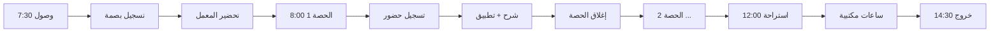

# تحليل دور المدرب — من الصلاحيات إلى التجربة

> وثيقة تحويل مهام المدرب من نص إداري في الهيكل التنظيمي إلى عمليات نظام، يوزر ستوريز، رحلة استخدام، وتجربة UX مميزة.

---

## ١. ملف الدور (Role Profile)

| العنصر | القيمة |
|---|---|
| **اسم الدور** | المدرب (TRAINER) |
| **المرجع المباشر** | رئيس القسم التدريبي |
| **المرجع غير المباشر** | وكيل شؤون المدربين |
| **التبعية الجانبية** | وكيل الجودة (للمؤشرات)، وكيل المتدربين (للتدريب التعاوني) |
| **النصاب الأسبوعي النموذجي** | 18 ساعة تدريبية |
| **بيئة العمل الفعلية** | فصل/معمل/ورشة + مكتب + رحلات تدريب تعاوني خارجية |
| **الأدوات الحالية** | جدول ورقي، WhatsApp، Excel، يدوي |
| **مستوى التقنية المتوقع** | متوسط — يستخدم الجوال أكثر من الكمبيوتر |
| **اللحظة الأكثر إجهاداً** | بداية الفصل (جداول جديدة) + نهاية الفصل (رصد درجات) |

### الإيقاع الزمني

```
يومي     → حضور المدرب + حضور المتدربين + تنفيذ الحصة
أسبوعي   → تقرير الورش/المعامل، متابعة المتأخرين
شهري     → تقييم منتصف الفصل، اجتماع قسم
فصلي     → اختبارات نهائية، رصد درجات، تقرير فصلي
سنوي     → تقييم الأداء، خطة تطوير مهني، مراجعة حقائب
```

---

## ٢. الرسالة، النواتج، المؤشرات

### الرسالة (Mission)
> «أن أُخرّج متدرباً قادراً على شغل وظيفة في سوق العمل التقني — لا أن أُلقّن مادة فقط.»

### النواتج المتوقعة (Outcomes)
1. **متدرب يجتاز** — معدل اجتياز ≥ 85% بعدالة وموضوعية
2. **متدرب يحضر** — معدل حضور المتدربين في شعبه ≥ 90%
3. **حقيبة محدّثة** — توصياته على المنهج تنعكس في المراجعة السنوية
4. **سلامة معملية** — صفر حادث في الورشة/المعمل
5. **تطوير ذاتي** — يكمل ساعات التطوير المهني المطلوبة سنوياً

### KPIs الشخصية للمدرب
| KPI | كيف يُقاس | الهدف |
|---|---|---|
| متوسط تقييم الزيارات الإشرافية | من جدول `supervision_visits` | ≥ 4.0/5 |
| التزام النصاب التدريبي | (ساعات نُفّذت / ساعات مجدولة) | ≥ 95% |
| معدل حضوره الشخصي | من `attendance` للمدرب | ≥ 98% |
| معدل اجتياز متدربيه | من `enrollments` بنتيجة PASSED | ≥ 85% |
| وقت الاستجابة لتقارير القسم | (تاريخ التسليم - تاريخ الاستحقاق) | ≤ 2 يوم |
| ساعات التطوير المهني | من `DevelopmentPlan.progress` | ≥ 24 ساعة/سنة |

---

## ٣. مصفوفة المهام → العمليات (Tasks → Operations Matrix)

| # | المهمة (من الـ PDF) | العملية في النظام | API Endpoint | الصلاحية | الشاشة |
|---|---|---|---|---|---|
| 1 | الالتزام بالحضور والانصراف | تسجيل بصمة/يدوي | `POST /attendance/me` | `trainer.attendance.mark` | `/me/attendance` |
| 2 | تنفيذ الجداول التدريبية | عرض جدول الشُعب الأسبوعي | `GET /trainers/me/schedule` | (ضمنية) | `/me/schedule` |
| 3 | تسجيل حضور المتدربين | رصد جماعي للحصة | `POST /academic/attendance/section/:id` | `trainer.section.attendance` | `/me/sections/:id/attendance` |
| 4 | تطبيق الاختبارات الفصلية والنهائية | إنشاء/إدارة اختبار + رصد درجات | `POST /lms/exams` + `POST /enrollments/:id/grade` | `trainer.exam.administer` + `academic.grade` | `/me/sections/:id/exam` |
| 5 | رصد درجات المتدربين | إدخال درجات الفصل | `POST /academic/enrollments/:id/grade` | `academic.grade` | `/me/sections/:id/grades` |
| 6 | الإشراف على التدريب التعاوني | متابعة CoopPlacement لمتدربيه | `GET /coop?supervisorId=me` + `POST evaluation` | `trainer.coop.supervise` | `/me/coop` |
| 7 | تقديم تقرير دوري لرئيس القسم | كتابة + رفع تقرير فصلي | `POST /trainers/me/reports` | `trainer.report.submit` | `/me/reports` |
| 8 | المشاركة في تقييم الحقائب | إضافة feedback على CurriculumReview | `POST /academic/curriculum-reviews/:id/feedback` | `trainer.curriculum.feedback` | `/curriculum/:id` |
| 9 | حضور دورات التطوير المهني | متابعة DevelopmentPlan + تحديث التقدم | `PATCH /trainers/me/development` | (ضمنية) | `/me/development` |
| 10 | الاطلاع على ملاحظات الزيارات الإشرافية | عرض supervision-visits | `GET /supervision-visits/me` | (ضمنية) | `/me/visits` ✅ |
| 11 | استقبال إشعارات (مهام جديدة، اعتمادات) | استلام Notifications | `GET /notifications` | (للجميع) | `/notifications` ✅ |
| 12 | الالتزام بالسلامة المهنية | تسجيل فحص قبل كل حصة معملية | `POST /sections/:id/safety-check` | `dept.safety.monitor` (مُفوّض) | `/me/sections/:id/start` |
| 13 | تنمية الموهوبين ورعاية القائم | توصية متدرب موهوب | `POST /trainees/:id/talent-recommendation` | `trainer.curriculum.feedback` | `/me/sections/:id/students` |
| 14 | متابعة المتدربين الجدد | عرض المتدربين الذين دخلوا حديثاً | `GET /trainees?cohort=current` | `trainees.read` | `/me/sections/:id/students` |
| 15 | تقديم تقرير عن الحاضنة (الحوادث) | فتح تذكرة سلامة/صيانة | `POST /services/maintenance` | (للجميع) | `/me/sections/:id/start` |

**الإجمالي: 15 عملية أساسية مرتبطة بـ 6 صلاحيات صريحة + 4 ضمنية**

---

## ٤. المهام بـ Job Stories (When → I want → So I can)

> Job Stories أنسب من User Stories الكلاسيكية لأن المدرب يقوم بمهامه في **سياق متغير** (الفصل، المعمل، السيارة، البيت).

### Epic 1: التحضير اليومي للحصة

```
When I'm walking to the workshop 5 min before class,
I want to see على جوالي: shaba، students count، أي طالب جديد، أي تنبيه سلامة،
So I can أدخل الفصل عارف الوضع تماماً وأبدأ من الثانية الأولى.
```

```
When the lab equipment is missing or broken,
I want to فتح بلاغ صيانة بثلاث ضغطات (صورة + موقع تلقائي + وصف صوتي)،
So I can أكمّل الحصة بخطة بديلة بدلاً من إضاعة 20 دقيقة على البحث.
```

### Epic 2: تسجيل الحضور (الجرس الذهبي)

```
When I'm starting the class with 25 students,
I want to تسجيل الحضور في < 30 ثانية (افتراضي "حاضر" + ضغطة على الغائبين فقط)،
So I can ابدأ الشرح فوراً بدون أن يفقد الطلاب التركيز.
```

```
When a student arrives 10 min late,
I want to ضغطة واحدة على اسمه يحوّله من "غائب" إلى "متأخر" مع تسجيل الوقت،
So I can أكون عادل وأحتفظ بسجل دقيق للأنماط.
```

```
When a student is repeatedly absent (3 مرات متتالية)،
I want to النظام يحذّرني تلقائياً ويقترح إصدار إنذار،
So I can أتحرك قبل أن يتدهور وضعه أكاديمياً.
```

### Epic 3: التقييم ورصد الدرجات

```
When the term ends and I have 5 sections × 30 students = 150 grade entries,
I want to إدخال الدرجات على شكل grid (Excel-like) مع validation فورية،
So I can أنهي الرصد في ساعة واحدة بدلاً من يوم كامل.
```

```
When I detect a pattern (متوسط الفصل تحت 60)،
I want to النظام يلفت نظري قبل التسليم النهائي،
So I can أراجع: هل المنهج صعب؟ هل الاختبار غير عادل؟ قبل أن يصبح مشكلة.
```

```
When I want to تطبيق اختبار إلكتروني،
I want to إعادة استخدام أسئلة من بنك سابق + توليد عشوائي،
So I can أوفر 3 ساعات إعداد وأضمن عدم تكرار النموذج.
```

### Epic 4: الإشراف على التدريب التعاوني

```
When متدرب من شعبتي بدأ تدريبه التعاوني،
I want to إشعار تلقائي بمعلومات الشركة + المشرف الميداني + مكان التدريب،
So I can أتابعه بزيارة ميدانية أو مكالمة بدون أن يصبح "مفقود".
```

```
When زرت متدرب في موقع التدريب،
I want to تسجيل الزيارة من جوالي بـ GPS + صورة + ملاحظة صوتية،
So I can أوثّق الزيارة دون شغل ورقي بعد العودة.
```

### Epic 5: التطوير المهني والمشاركة

```
When طلب رئيس القسم رأياً في حقيبة المقرر،
I want to إضافة ملاحظة على بند محدد من الحقيبة (مع لقطة شاشة)،
So I can أساهم في التطوير دون كتابة تقرير منفصل.
```

```
When أكملت دورة تدريبية خارجية،
I want to رفع شهادة + ساعات تلقائياً تنعكس على خطة تطويري،
So I can أُحسّب لي ساعات التطوير المطلوبة سنوياً بدون تتبع يدوي.
```

### Epic 6: التواصل مع الإدارة

```
When رئيس القسم زارني في حصة وأعطاني تقييم،
I want to قراءة التقييم بهدوء + الرد بتعليق + توقيع رقمي،
So I can أتحول التقييم من "حدث مفاجئ" إلى محادثة موثقة.
```

```
When عندي إجازة طارئة 3 أيام،
I want to تقديم الطلب من جوالي + اقتراح بديل من زملائي تلقائياً،
So I can أحلّ الجدول بدون كرة سلة بين الإدارة والوكيل.
```

---

## ٥. رحلة المدرب (Trainer Journey Map)

### المرحلة ١: الانضمام (Onboarding) — أول أسبوعين

| المحطة | الجوب-تو-بي-دن | نقطة الألم | فرصة النظام |
|---|---|---|---|
| استلام التكليف | أعرف ماذا سأدرّس وأين | "كم شعبة؟ متى؟ أين الفصول؟" | شاشة "أول يومي" تجمع الجدول + الخريطة + جهات الاتصال |
| لقاء رئيس القسم | أفهم توقعاتي | تتبدد المعلومات في WhatsApp | "كتيّب رقمي" مخصص يفتح من الإشعار |
| دخول الأنظمة | أعمل setup للحساب | كلمات سر متعددة، ربط ضائع | SSO + روابط تجريبية معزولة |
| أول حصة | أبدأ بثقة | ما أعرف الطلاب، ما عندي مفاتيح | Profile للشعبة قبل الحصة + "تذكير: استلم مفتاح المعمل من X" |

### المرحلة ٢: التدريس اليومي — الإيقاع المعتاد



**نقاط الاحتكاك**:
- تأخر فتح الفصل بسبب نسيان مفتاح
- المتدرب الذي ينسى لابتوبه (هل أحسبه غائب؟)
- الإشعارات الإدارية تأتي وسط الشرح

**فرص النظام**:
- "Class mode" زر واحد في أعلى الشاشة → يكتم الإشعارات حتى نهاية الحصة
- قائمة طلاب مع صورة + ملاحظات شخصية ("هذا أصمّ يحتاج مكان أمامي")
- زر "عذر/تأخير" بدلاً من "غائب" مع تتبع تلقائي للأنماط

### المرحلة ٣: تقييم نهاية الفصل — الذروة الأكثر إرهاقاً

```
الأسبوع 14:  اختبار نهائي
الأسبوع 15:  رصد درجات → 150 درجة في 5 شعب
الأسبوع 16:  تسليم → اعتماد رئيس قسم → نشر للطلاب
```

**نقاط الألم الكبرى**:
1. **العمل تحت ضغط زمني** (3 أيام لـ 150 درجة)
2. **خوف من خطأ يأخره أسبوع** (رقم ينقصه نقطة، رفض الاعتماد)
3. **مقاومة الطلاب** بعد النشر (طلب مراجعة)

**فرص النظام**:
- **Excel-like grid** مع save تلقائي + undo + حفظ كمسوّدة
- **Bell-curve preview** قبل التسليم: "إذا اعتمدت، 12 سيرسبون. هل تريد المراجعة؟"
- **Audit trail شفاف**: الطالب يشاهد من رصد، متى، ولا يقدر يطعن إلا بإجراء رسمي

### المرحلة ٤: المراجعة السنوية والتطوير

| المحطة | ماذا يحدث الآن (ورقياً) | كيف يكون أفضل |
|---|---|---|
| تقييم الأداء السنوي | استمارة طويلة من رئيس القسم | جمع تلقائي للـ KPIs + الزيارات + الحضور + المتدربين، يبقى فقط النص الإنساني |
| خطة التطوير المهني | خطة نمطية لكل المدربين | مقترح مخصص بناءً على ملاحظات الزيارات الإشرافية |
| المشاركة في تطوير الحقائب | تنسى وتتأخر | feedback inline من خلال السنة، يتجمع للمراجعة |
| الترقية / تجديد العقد | قرار يدوي | لوحة "ملفي المهني" تُظهر الإنجازات + الفجوات |

---

## ٦. ركائز الـ UX المميزة (UX Pillars)

### 🎯 P1: Mobile-First, Workshop-Aware
المدرب لا يفتح Dashboard على شاشة 27" — يفتحه على iPhone أثناء المشي بين الفصل والمعمل.
- **الأهم في الأعلى**: حصتي القادمة، الحضور المعلق، تقرير لم يُسلم
- **زر FAB بحجم إبهام** للعمليات الأكثر تكراراً (تسجيل حضور)
- **يعمل offline**: تسجيل الحضور بدون نت، يُزامن لاحقاً
- **تكبير تلقائي للخطوط في Light/Sun mode** (الورش فيها إضاءة قوية)

### 🤝 P2: Trust Through Transparency
- المدرب يشاهد **كل تقييم** سُجِّل عنه (لا "تقييم سري")
- الطلاب يشاهدون **كيف رُصدت** درجاتهم (الاختبار + الواجبات + الحضور = X)
- زر "**اعترض**" واضح ومسار اعتراض موثّق

### ⏱ P3: Time Compression
كل عملية تكرارية لازم تنزل من دقائق إلى ثوانٍ:
- تسجيل حضور 30 طالب: من 5 دقائق → **30 ثانية**
- إدخال 30 درجة: من 10 دقائق → **2 دقيقة** (paste من Excel)
- فتح بلاغ صيانة: من نموذج 8 حقول → **3 خطوات** (صورة + قسم + موقع تلقائي)

### 🧠 P4: Anticipatory Intelligence
النظام يحذّر **قبل** المشكلة، ولا ينتظر حدوثها:
- "هذا الطالب غاب 3 مرات. حذّره؟"
- "متوسط فصل #2 منخفض. راجع الاختبار؟"
- "آخر زيارة إشرافية لك قبل 6 أشهر — احجز مع رئيس القسم؟"
- "خطة تطويرك السنوية: نقصك 8 ساعات. هذي 3 دورات مقترحة"

### 🔇 P5: Respect Focus Time
- "**Class Mode**" يكتم كل الإشعارات أثناء الحصة
- **بدون email** كقناة افتراضية — كل شيء in-app
- **تجميع الإشعارات** في خلاصة يومية صباحية (بدلاً من بنق-بنق)

### 📱 P6: Single-Hand Operation
معظم لحظات استخدام المدرب: يحمل لابتوب بيد + جوال بالأخرى. لذلك:
- التنقل عبر **Swipe** بين الشُعب
- زر "**التالي**" دائماً في يمين الإبهام
- نموذج طلب إجازة / تذكرة من شاشة واحدة فقط

---

## ٧. شاشات مقترحة (Critical Screens to Build Next)

### 🔝 1. "اليوم" (Trainer Today) — الأهم
صفحة افتراضية للمدرب على جواله. تحوي:
```
┌─────────────────────────────────┐
│ صباح الخير، أ. ياسر           │
│ ٢٧ ربيع الآخر — الأحد          │
├─────────────────────────────────┤
│ ⏰ الحصة القادمة: 8:00          │
│   شبكات متقدمة • معمل ٢ • ٢٧ ط │
│   [بدء الحصة]                  │
├─────────────────────────────────┤
│ 🔔 ٣ تنبيهات                  │
│ • طالب تأخر 3 مرات هذا الأسبوع │
│ • تقرير فصل #١ — ٢ يوم متبقي  │
│ • تقييم إشرافي جديد            │
├─────────────────────────────────┤
│ 📊 هذا الأسبوع                  │
│ ساعات: ١٢ / ١٨   حضوري: ٩٨٪    │
└─────────────────────────────────┘
```

### 🟢 2. "بدء الحصة" (Start Class) — One-tap entry
زر واحد يفعّل وضع التدريس:
- يفتح list المتدربين بـ swipe-to-mark
- يكتم الإشعارات لمدة الحصة
- يفعّل "Safety check" (إذا معمل) — chip ✅
- يبدأ مؤقت الحصة

### 📊 3. "Grid الدرجات" — Excel-grade entry
- 30 صف × 5 أعمدة (الاختبارات والواجبات)
- Tab → ينتقل للعمود التالي
- Paste من Excel يُملأ الكل
- Save تلقائي كل 10 ثوان
- Bell curve مصغّر في الجانب

### 🎬 4. "ملف المتدرب" (Student Profile in Class)
لما يضغط المدرب على اسم طالب:
- **صورة + اسم + رقم جامعي**
- **حضور**: 89% (-3 الأسبوع الماضي)
- **آخر درجة**: 78
- **ملاحظة شخصية مني** (private): "صعوبة في التركيز بعد العاشرة"
- **ملاحظات سابقة من المدربين الآخرين** (مع إذن)

### 🛡 5. "Safety Check" (للمعامل والورش)
checklist بصري قبل بدء الحصة:
```
✅ كل الأجهزة سليمة
✅ مخارج الطوارئ مفتوحة
✅ صناديق الإسعاف جاهزة
☐  وصلات الكهرباء آمنة
   [الحصة لن تبدأ حتى ✅ كل البنود]
```

### 📝 6. "تقرير الحصة" (3-tap report)
بعد كل حصة:
- "كيف كانت؟" 😊 😐 😞 (واحد ضغطة)
- "هل أكملت الخطة؟" نعم / جزئي / لا
- "ملاحظات سريعة" (صوتي اختياري)

---

## ٨. عداد الفجوات والأولويات (Gap Analysis)

### ✅ متوفر الآن
- صلاحيات مكتملة (8 صلاحيات)
- صفحة "تقييماتي" `/me/visits`
- صفحة "إجازاتي" `/me/leaves`
- صفحة "تذاكري" `/me/tickets`
- إشعارات in-app
- جدول `TraineeAttendance` (قاعدة)

### 🔧 ينقص (مرتب بالأولوية)

| # | الميزة | حجم العمل | الأثر |
|---|---|---|---|
| **1** | شاشة "اليوم" (Trainer Today) | 4 ساعات | **🔥 ضخم** — هذي الصفحة الأم |
| **2** | تسجيل حضور المتدربين بسرعة (UI) | 3 ساعات | **🔥 ضخم** — أكثر عملية تكراراً |
| **3** | جدولي الأسبوعي `/me/schedule` | 2 ساعات | عالي |
| **4** | Grid الدرجات | 4 ساعات | عالي (نهاية الفصل) |
| **5** | تقارير دورية للمدرب `/me/reports` | 3 ساعات | متوسط |
| **6** | ملف المتدرب الكامل + ملاحظات شخصية | 3 ساعات | متوسط |
| **7** | Safety Check قبل الحصة | 2 ساعات | متوسط — يميّز النظام |
| **8** | متابعة التدريب التعاوني `/me/coop` | 4 ساعات | متوسط |
| **9** | خطة التطوير المهني + رفع شهادات | 3 ساعات | متوسط |
| **10** | Class Mode (إخراس الإشعارات) | 1 ساعة | ⭐ صغير لكن delightful |
| **11** | offline حضور (PWA) | 6 ساعات | كبير لكن high-impact |
| **12** | Bell curve preview قبل الإيداع | 2 ساعات | ⭐ يميّز النظام |

### 📌 موصى الترتيب: **1 → 2 → 3 → 10 → 4 → 6 → 7 → 11**

---

## ٩. مبادئ الكتابة (Writing for the Trainer)

| ❌ تجنّب | ✅ بدلاً من ذلك |
|---|---|
| "تقديم طلب" | "أرسل" |
| "هذا الإجراء سيتم اعتماده" | "العميد سيراه ويعتمده" |
| "خطأ في النظام" | "ما زبط — جرّب الحفظ مرة ثانية" |
| "الفصل التدريبي" | "الفصل" |
| "المنشأة التدريبية" | "الكلية" |
| رسائل بصيغة الجمع الرسمية | "تمام يا أ. ياسر" (شخصية بدون مبالغة) |

---

## ١٠. الخلاصة الاستراتيجية

> **المدرب ليس "موظف ينفّذ مهام" — بل خبير يحتاج النظام أن يحترم وقته، يحرّره من البيروقراطية، ويعطيه أدوات تجعله مدرباً أفضل لا موظفاً أفضل فقط.**

### قاعدة الـ 80/20
- **80% من حياة المدرب** = حصتين/معمل/تدريس → النظام يجب أن **يختفي** هنا
- **20% من حياة المدرب** = إدارة/تقارير/تقييمات → النظام يجب أن **يُسرّع** هنا

### 3 شاشات تكفي لتغيير حياة المدرب
1. **"اليوم"** — صفحة افتتاح ذكية
2. **"حضور الحصة"** — 30 ثانية بدلاً من 5 دقائق
3. **"درجات نهاية الفصل"** — grid + bell curve + safe save

كل شي ثاني نخمة، يجي بعدين.

---

**نهاية التحليل** — هذي الوثيقة جاهزة للتنفيذ. للبناء، اختر العنصر من جدول الفجوات (§٨).
